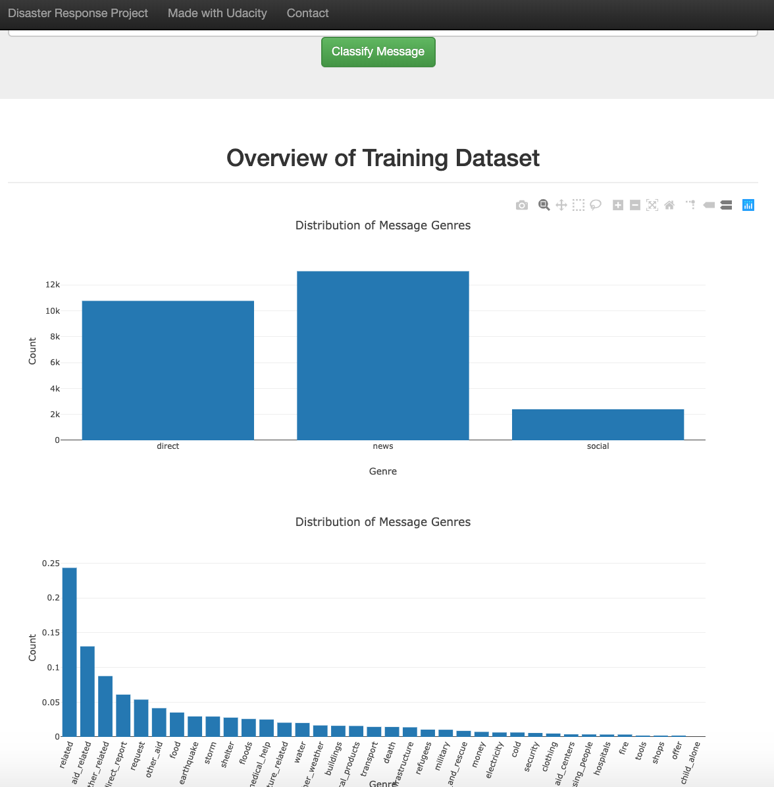

# Disaster Response Pipeline Project
You can imagine that when a disaster happens, millions of messages are communicated through
a variety of channels, such as social media. Moreover, usually there are different organizations
involved in trying to solve the problem. Usually, each organization is focused on one
particular problem, such as providing water. Figure Eight provided us a dataset with real
messages categorized into one kind of particular need for support, such as food, water and shelter.
Therefore, our goal is to use these messages to create a classifier that is able to identify the type
of support requested in a particular piece of text.

### Motivation
The objective of this project is to build a full ETL pipeline for treating this data as well as a
Machine Learning pipeline that will perform a Natural Language Processing (NLP) to identify in which
category a particular message can be included on. Therefore, this is a multi-target classification
problem.

The resulting model is used to make visualizations and predictions through a dashboard built on Flask and
Plotly.

### Files in this repository
- README.md: the present file
- ETL Pipeline Preparation.ipynb: jupyter notebook with first ETL analysis
- ML Pipeline Preparation.ipynb: jupyter notebook with first ML analysis
- models/train_classifier.py: script for training the NLP model
- data/process_data.py: the ETL routine
- data/disaster_messages.csv: the messages data
- data/disaster_categories.csv: the messages categories
- app/run.py: dashboard tasks (Flask)
- app/templates/: HTML templates

### Results
Results were dislayed in a dashboard using HTML, Flask and Plotly, as shown bellow:

With this dashboard, one can easily insert a massage to be classified and visualized the predicted
categories. Moreover, the main page includes some visualizations:

It is intresting to point out that child alone is the categorie with the lowest proportion of messages
in opposed to related.

### How to Run This Project
1. Run the following commands in the project's root directory to set up your database and model.

    - To run ETL pipeline that cleans data and stores in database
        `python data/process_data.py data/disaster_messages.csv data/disaster_categories.csv data/DisasterResponse.db`
    - To run ML pipeline that trains classifier and saves
        `python models/train_classifier.py data/DisasterResponse.db models/classifier.pkl`

2. Run the following command in the app's directory to run your web app.
    `python run.py`

3. Go to http://0.0.0.0:3001/

### Used Libraries
- Pandas
- Numpy
- Plotly
- json
- nltk
- sqlalchemy
- Flask
- scikit-learn
- joblib

### Acknowledgements
I would like to ackonwledge Udacity for providing materials as part of the Data Scientist Nanodegree
and Figure Eight for the datasets, insights and support.